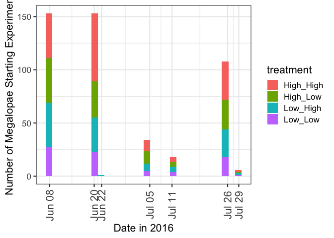
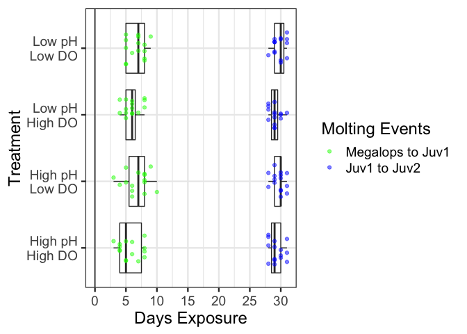
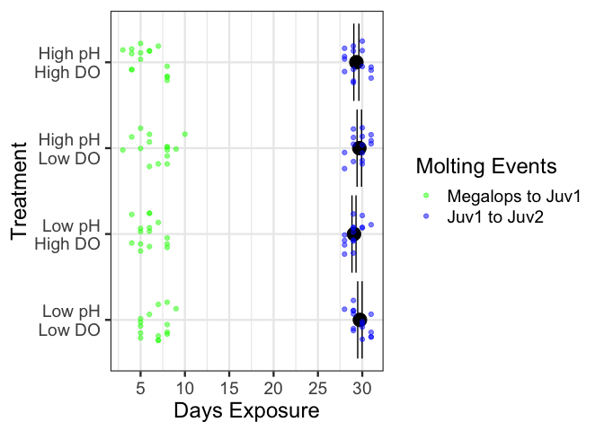
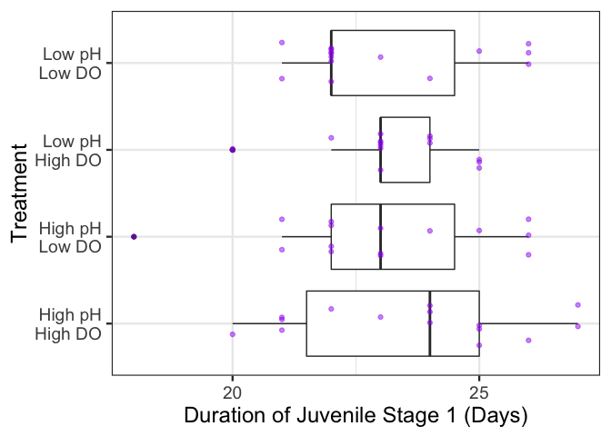
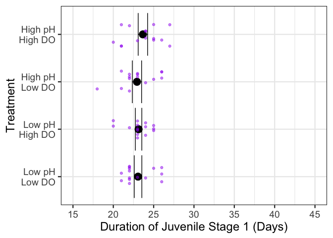

Molt time analysis of 2016 crabs selected for metabolomics
================
Shelly Trigg
4/12/2019

Load libraries

    ## 
    ## Attaching package: 'psych'

    ## The following objects are masked from 'package:ggplot2':
    ## 
    ##     %+%, alpha

    ## 
    ## Attaching package: 'tidyr'

    ## The following object is masked from 'package:reshape2':
    ## 
    ##     smiths

    ## Loading required package: Matrix

    ## 
    ## Attaching package: 'Matrix'

    ## The following object is masked from 'package:tidyr':
    ## 
    ##     expand

    ## 
    ## Attaching package: 'lmerTest'

    ## The following object is masked from 'package:lme4':
    ## 
    ##     lmer

    ## The following object is masked from 'package:stats':
    ## 
    ##     step

    ## Loading required package: lattice

Read in and format crabs selected for metabolomics data

``` r
#this data was created by Krista and is on the OA drive in the metabolomics analysis folder in the crab_2016_pHxDO_megalopae folder and called "crab OA omics samples 2016.xlsx"
good_mega <- read_xlsx("~/Documents/GitHub/pHxDO_Crab_metabolomics/TreatmentEffectOnStageDuration/data/crab OA omics samples 2016.xlsx", sheet = "metabolomics selected 4.17", skip = 2)

#make a start date character string column
good_mega$dateString <- paste(substr(good_mega$startDate,7,7),substr(good_mega$startDate,9,10),substr(good_mega$startDate,3,4), sep = ".")  

#convert datastring column to match date string column format in crab data below
for(i in 1:length(good_mega$dateString)){
  if(substr(good_mega$dateString[i],3,3) == 0){
    good_mega$dateString[i] <- gsub("0","",good_mega$dateString[i])
  }
}

#make a crabID column that will match data string column format in crab data below
good_mega$crabID <- paste(good_mega$MOATS, good_mega$JAR, good_mega$dateString, sep = "_")
```

read in stage data file

``` r
#this data is on the OA drive under Experiments -> Crab -> Crab megalopae 2016 called "Updated Megalopae-Juvenile Data Sheet.csv"
d <- read.csv("~/Documents/GitHub/pHxDO_Crab_metabolomics/TreatmentEffectOnStageDuration/data/Updated Megalopae-Juvenile Data Sheet.csv", 
              stringsAsFactors=FALSE, skip = 1, header = TRUE)
#str(d)
#View(d)
#last day of observation
lastDayObs <- "9.10.16"
#remove M13
d <- subset(d, MOATS != "M13")
```

read MOATS treatment table

``` r
#this data was created from "Treatments.xlsx" on the OA drive under Experiments -> Crab -> Crab megalopae 2016
dTreat <- read.csv("~/Documents/GitHub/pHxDO_Crab_metabolomics/TreatmentEffectOnStageDuration/data/Treatments_2016_08_15.csv")
#View(dTreat)
```

clean up input data

``` r
#remove blank rows
d <- subset(d, MOATS != "")
#convert to long skinny data
d <- gather(d, date, status, X6.8.16:X9.10.16)
# add treatments for each MOATS
d <- merge(d, dTreat, "MOATS")
#creat moats_jar ID
d$MOATSjar <- paste(d$MOATS, "_", d$JAR, sep = "")
#format date
d$dateString <- substring(as.character(d$date),2)
d$date <- as.POSIXlt(strptime(d$dateString, "%m.%d.%y"))
#remove respirometry crabs, not Dungness, and empty jars
d <-subset(d, substring(status,1,1) != "R" & status != "Not Dung." & status != "" & status != "---")
length(d$status)
```

    ## [1] 15320

``` r
levels(factor(d$status))
```

    ## [1] "1J"        "1J-dead"   "2J"        "dead"      "dead/M1"   "FREEZE"   
    ## [7] "FREEZE/M1" "m"         "M1"

``` r
#create seperate rows if crabs removed and added on the same day
for(i in 1:length(d$status)){
  if(d$status[i] == "FREEZE/M1"){
    d$status[i] <- "FREEZE"
    newRow <- d[i,]
    newRow$status <- "M1"
    d <- rbind(d, newRow)
  }
  if(d$status[i] == "dead/M1"){
    d$status[i] <- "dead"
    newRow <- d[i,]
    newRow$status <- "M1"
    d <- rbind(d, newRow)
  }
}
d$status <- factor(d$status)
length(d$status)
```

    ## [1] 15327

``` r
levels(factor(d$status))
```

    ## [1] "1J"      "1J-dead" "2J"      "dead"    "FREEZE"  "m"       "M1"

``` r
#sort by MOATSjar, date, and status (stats sort required for cases where crabs removed and started on same day)
d <- d[order(d$MOATSjar ,d$date, d$status), ]

#assign crabID 
d$crabID <- NA
for(i in 1:length(d$status)){
  if(d$status[i] == "M1"){
    cID <-  paste(d$MOATSjar[i], d$dateString[i], sep = "_")
  }
  d$crabID[i] <- cID
  if(d$status[i] == "dead" || d$status[i] == "FREEZE" || d$status[i] == "1J-dead"){
    cID <- NA
  }
  d$crabID[i] <- cID
}
#View(subset(d, is.na(crabID)))

#format as factors
#d$treatment <- paste(d$pH_treatment, "_", d$DO_Treatment, sep = "")
d$MOATSjar <- as.factor(d$MOATSjar)
d$status <- as.factor(d$status)
as.data.frame(table(d[ , c("status")]))
```

    ##      Var1  Freq
    ## 1      1J 11020
    ## 2 1J-dead     2
    ## 3      2J   864
    ## 4    dead    33
    ## 5  FREEZE   431
    ## 6       m  2504
    ## 7      M1   473

``` r
d$crabID <- factor(d$crabID)
levels(d$status)
```

    ## [1] "1J"      "1J-dead" "2J"      "dead"    "FREEZE"  "m"       "M1"

``` r
#make event columns
d$event <- ""

#assign events (assumes sorted by crabID, date and status)
for(i in 2:length(d$MOATS)){
  if(d$status[i-1] == "M1"){
    d$event[i-1] <- "Start"
  } 
  if(d$status[i-1] == "M1" && d$status[i] == "dead"){
    d$event[i] <- "mToDead"
  }
  if(d$status[i-1] == "M1" && d$status[i] == "J1-dead"){
    d$event[i] <- "mToJ1Dead"
  }
  if(d$status[i-1] == "m" && d$status[i] == "dead"){
    d$event[i] <- "mToDead"
  }
  if(d$status[i-1] == "m" && d$status[i] == "1J-dead"){
    d$event[i] <- "mToJ1Dead"
  }
  if(d$status[i-1] == "M1" && d$status[i] == "1J"){
    d$event[i] <- "mToJ1"
  }
  if(d$status[i-1] == "m" && d$status[i] == "1J"){
    d$event[i] <- "mToJ1"
  }
  if(d$status[i-1] == "1J" && d$status[i] == "dead"){
    d$event[i] <- "J1ToDead"
  }
  if(d$status[i-1] == "1J" && d$status[i] == "2J"){
    d$event[i] <- "J1ToJ2"
  }
  if(d$status[i-1] == "2J" && d$status[i] == "dead"){
    d$event[i] <- "J2ToDead"
  }
  if(d$status[i-1] == "2J" && d$status[i] == "FREEZE"){
    d$event[i] <- "J2ToFreeze"
  }
  if(d$event[i] == "" && d$dateString[i] == lastDayObs)
    d$event[i] <- "aliveNoMoltLastObs"
}
#View(d)
#frequency of each event
as.data.frame(table(d[ , c("event")]))
```

    ##         Var1  Freq
    ## 1            13501
    ## 2   J1ToDead    19
    ## 3     J1ToJ2   433
    ## 4   J2ToDead     2
    ## 5 J2ToFreeze   431
    ## 6    mToDead    12
    ## 7      mToJ1   454
    ## 8  mToJ1Dead     2
    ## 9      Start   473

``` r
#assign durations
d$duration <- NA
durCounter <- 0
for(i in 1:length(d$MOATS)){
  if(d$event[i] == "Start"){
    durCounter <- 0
  }
  d$duration[i] <- durCounter
  durCounter <- durCounter + 1
}
```

plot start dates
----------------

``` r
d$date <- as.POSIXct(d$date)
startDays <- levels(factor(as.character(subset(d, event == "Start")$date)))
startDays <- strptime(startDays, "%Y-%m-%d")
startDays <- as.POSIXct(startDays)
class(startDays)
```

    ## [1] "POSIXct" "POSIXt"

``` r
aes(fill = factor(treatment))
```

    ## Aesthetic mapping: 
    ## * `fill` -> `factor(treatment)`

``` r
levels(factor(subset(d, event == "Start")$treatment))
```

    ## [1] "High_High" "High_Low"  "Low_High"  "Low_Low"

``` r
ggplot(subset(d, event == "Start"), aes(x=date)) + geom_histogram(aes(fill = treatment)) +
  theme_bw(base_size = 16) + 
  scale_x_datetime(breaks = startDays, date_labels = "%b %d") +
  xlab("Date in 2016") + ylab("Number of Megalopae Starting Experiment") + 
  theme(axis.text.x  = element_text(angle=90, vjust=0.5, size=16))
```

    ## `stat_bin()` using `bins = 30`. Pick better value with `binwidth`.



Plot of time to transition and death by treatment
-------------------------------------------------

``` r
d$event2 <- ""
d$event2[d$event %in% c("J1ToDead", "J2ToDead", "mToDead", "mToJ1Dead")] <- "dead"
d$event2[d$event == "mToJ1"] <- "mToJ1"
d$event2[d$event == "J1ToJ2"] <- "J1ToJ2"

#box plot
ggplot(subset(d[which(d$crabID %in% good_mega$crabID),], event2 != ""), aes(treatment, duration)) + 
  geom_boxplot(data = subset(d[which(d$crabID %in% good_mega$crabID),], event2 == "mToJ1")) +
  geom_boxplot(data = subset(d[which(d$crabID %in% good_mega$crabID),], event2 == "J1ToJ2")) + 
  geom_jitter(aes(color = event2), height = 0, width =  0.25, alpha = 0.5) + 
  geom_hline(aes(yintercept = 0)) +
  theme_bw(base_size = 18) + 
  scale_y_continuous(breaks = seq(0,45,5)) + 
  scale_x_discrete(labels = c("High pH\nHigh DO", "High pH\nLow DO", "Low pH\nHigh DO", "Low pH\nLow DO")) + 
  scale_color_manual(values=c("blue", "green", "red"), 
                     name="Molting Events",
                     breaks=c("mToJ1", "J1ToJ2", "dead"),
                     labels=c("Megalops to Juv1", "Juv1 to Juv2", "Died")) +
  ylab("Days Exposure") + xlab("Treatment") + 
  coord_flip()
```



Create separate columns for pH and DO treatment from the one treatment column

``` r
treatment_list <- unlist(strsplit(as.character(d$treatment), "_"))
treatment_matrix <- matrix(treatment_list, ncol = 2, byrow = TRUE)
pH_and_DO <- as.data.frame(treatment_matrix)
colnames(pH_and_DO) <- c("pH_treatment", "DO_treatment")

d <- cbind(d,pH_and_DO)
```

Run ANOVA on m to J1 duration x treatment
-----------------------------------------

``` r
fit <- aov(duration ~ treatment,data = subset(d[which(d$crabID %in% good_mega$crabID),], event2 == "mToJ1"))
summary(fit)
```

    ##             Df Sum Sq Mean Sq F value Pr(>F)
    ## treatment    3  12.72   4.239   1.598    0.2
    ## Residuals   56 148.53   2.652

Run ANOVA on m to J1 duration ~ pH\_treatment\*DO\_treatment
------------------------------------------------------------

``` r
fit <- aov(duration ~ pH_treatment*DO_treatment,data = subset(d[which(d$crabID %in% good_mega$crabID),], event2 == "mToJ1"))
summary(fit)
```

    ##                           Df Sum Sq Mean Sq F value Pr(>F)  
    ## pH_treatment               1   0.15   0.150   0.057 0.8129  
    ## DO_treatment               1  12.15  12.150   4.581 0.0367 *
    ## pH_treatment:DO_treatment  1   0.42   0.417   0.157 0.6934  
    ## Residuals                 56 148.53   2.652                 
    ## ---
    ## Signif. codes:  0 '***' 0.001 '**' 0.01 '*' 0.05 '.' 0.1 ' ' 1

Run ANOVA on J1 to J2 duration x treatment
------------------------------------------

``` r
fit <- aov(duration ~ treatment,data = subset(d[which(d$crabID %in% good_mega$crabID),], event2 == "J1ToJ2"))
summary(fit)
```

    ##             Df Sum Sq Mean Sq F value Pr(>F)
    ## treatment    3   4.32  1.4389   1.478   0.23
    ## Residuals   56  54.53  0.9738

Run ANOVA on J1 to J2 duration ~ pH\_treatment\*DO\_treatment
-------------------------------------------------------------

``` r
fit <- aov(duration ~ pH_treatment*DO_treatment,data = subset(d[which(d$crabID %in% good_mega$crabID),], event2 == "J1ToJ2"))
summary(fit)
```

    ##                           Df Sum Sq Mean Sq F value Pr(>F)  
    ## pH_treatment               1   0.15   0.150   0.154 0.6962  
    ## DO_treatment               1   3.75   3.750   3.851 0.0547 .
    ## pH_treatment:DO_treatment  1   0.42   0.417   0.428 0.5157  
    ## Residuals                 56  54.53   0.974                 
    ## ---
    ## Signif. codes:  0 '***' 0.001 '**' 0.01 '*' 0.05 '.' 0.1 ' ' 1

Plot with standard errors
-------------------------

``` r
#Run summarySE function at bottom of this page first
(meanHighPH <- mean(subset(d[which(d$crabID %in% good_mega$crabID),],pH_treatment == "High" & event2 == "J1ToJ2")$duration, na.rm = TRUE))
```

    ## [1] 29.5

``` r
(meanLowPH <- mean(subset(d[which(d$crabID %in% good_mega$crabID),],pH_treatment == "Low"& event2 == "J1ToJ2")$duration, na.rm = TRUE))
```

    ## [1] 29.4

``` r
meanLowPH - meanHighPH
```

    ## [1] -0.1

``` r
summaryForErrorBars <- summarySE(subset(d[which(d$crabID %in% good_mega$crabID),], event2 == "J1ToJ2"), measurevar="duration", groupvars=c("treatment"), na.rm = TRUE)
#View(summaryForErrorBars)
summaryForErrorBars$treatment <- factor(summaryForErrorBars$treatment)
summaryForErrorBars$treatment <- factor(summaryForErrorBars$treatment, levels= rev(levels(summaryForErrorBars$treatment)))
levels(summaryForErrorBars$treatment)
```

    ## [1] "Low_Low"   "Low_High"  "High_Low"  "High_High"

``` r
d$treatment <- as.character(d$treatment)
ggplot(summaryForErrorBars, aes(treatment, duration)) + 
  geom_errorbar(aes(ymin = duration - se, ymax = duration + se))+
  geom_point(size = 5) +
  geom_jitter(data = subset(d[which(d$crabID %in% good_mega$crabID),], event2 != ""), aes(x = treatment, y = duration, color = event2), 
              height = 0, width =  0.25, alpha = 0.5) + 
  theme_bw(base_size = 18) + 
  scale_y_continuous(breaks = seq(0,65,by=5)) +
  scale_x_discrete(labels = c("Low pH\nLow DO", "Low pH\nHigh DO", "High pH\nLow DO", "High pH\nHigh DO", "High pH\nLow DO")) +
  scale_color_manual(values=c("blue", "green", "red"),
                     name="Molting Events",
                     breaks=c("mToJ1", "J1ToJ2", "dead"),
                     labels=c("Megalops to Juv1", "Juv1 to Juv2", "Died")) +
  ylab("Days Exposure") + xlab("Treatment") + 
  coord_flip()
```



duration of Juvenile\_1 stage
-----------------------------

``` r
dEvents <- subset(d[which(d$crabID %in% good_mega$crabID),], event != ""& MOATS != "M13")
dCrab <- dcast(dEvents, crabID + treatment + pH_treatment + DO_treatment + MOATS~ event, value.var = "duration")
dCrab$J1dur <- dCrab$J1ToJ2 - dCrab$mToJ1
#View(dCrab)
```

boxplot J1 duration
-------------------

``` r
ggplot(dCrab, aes(treatment, J1dur)) + 
  geom_boxplot() +
  geom_jitter(colour = "purple", height = 0, width =  0.25, alpha = 0.5) + 
  theme_bw(base_size = 18) + 
  scale_y_continuous(breaks = seq(15,60,5)) + 
  scale_x_discrete(labels = c("High pH\nHigh DO", "High pH\nLow DO", "Low pH\nHigh DO", "Low pH\nLow DO")) + 
  ylab("Duration of Juvenile Stage 1 (Days)") + xlab("Treatment") + 
  coord_flip()
```



Plot with standard errors for J1 duration
=========================================

``` r
#Run summarySE function at bottom of this page first
summaryForErrorBars <- summarySE(dCrab, measurevar="J1dur", groupvars=c("treatment"), na.rm = TRUE)
subset(dCrab,pH_treatment == "High")$J1dur
```

    ##  [1] 22 26 22 18 26 25 23 22 23 26 21 24 21 25 24 27 25 21 22 23 24 25 23
    ## [24] 26 20 24 21 21 27 22

``` r
meanHighPH <- mean(subset(dCrab,pH_treatment == "High")$J1dur, na.rm = TRUE)
meanHighPH
```

    ## [1] 23.3

``` r
meanLowPH <- mean(subset(dCrab,pH_treatment == "Low")$J1dur, na.rm = TRUE)
meanLowPH - meanHighPH
```

    ## [1] -0.2

``` r
#View(summaryForErrorBars)
summaryForErrorBars$treatment <- factor(summaryForErrorBars$treatment)
summaryForErrorBars$treatment <- factor(summaryForErrorBars$treatment, levels= rev(levels(summaryForErrorBars$treatment)))
levels(summaryForErrorBars$treatment)
```

    ## [1] "Low_Low"   "Low_High"  "High_Low"  "High_High"

``` r
dCrab$treatment <- as.character(dCrab$treatment)
ggplot(summaryForErrorBars, aes(treatment, J1dur)) + 
  geom_errorbar(aes(ymin = J1dur - se, ymax = J1dur + se))+
  geom_point(size = 5) +
  geom_jitter(data = dCrab, aes(treatment, J1dur), colour = "purple", height = 0, width =  0.25, alpha = 0.5) + 
  #geom_hline(aes(yintercept= meanHighPH)) +
  #geom_hline(aes(yintercept= meanLowPH)) +
  theme_bw(base_size = 18) + 
  scale_y_continuous(breaks = seq(15,60,by=5), limits = c(15,45)) + 
  scale_x_discrete(labels = c("Low pH\nLow DO", "Low pH\nHigh DO", "High pH\nLow DO", "High pH\nHigh DO", "High pH\nLow DO")) + 
  ylab("Duration of Juvenile Stage 1 (Days)") + xlab("Treatment") + 
  coord_flip()
```



ANOVA of J1 duration x treatment
--------------------------------

``` r
fit <- aov(J1dur ~ treatment, data = dCrab)
summary(fit)
```

    ##             Df Sum Sq Mean Sq F value Pr(>F)
    ## treatment    3   4.67   1.556   0.394  0.758
    ## Residuals   56 220.93   3.945

Anova on Juv1 stage duration: no random effects
-----------------------------------------------

``` r
fit <- aov(J1dur ~ pH_treatment*DO_treatment, data = dCrab)
summary(fit)
```

    ##                           Df Sum Sq Mean Sq F value Pr(>F)
    ## pH_treatment               1   0.60   0.600   0.152  0.698
    ## DO_treatment               1   2.40   2.400   0.608  0.439
    ## pH_treatment:DO_treatment  1   1.67   1.667   0.422  0.518
    ## Residuals                 56 220.93   3.945

Anova on Juv1 stage duration: with random MOATS effects
=======================================================

``` r
fitME <- lmer(J1dur ~ pH_treatment*DO_treatment + (1|MOATS), data = dCrab)
```

    ## singular fit

``` r
summary(fitME)
```

    ## Linear mixed model fit by REML. t-tests use Satterthwaite's method [
    ## lmerModLmerTest]
    ## Formula: J1dur ~ pH_treatment * DO_treatment + (1 | MOATS)
    ##    Data: dCrab
    ## 
    ## REML criterion at convergence: 246.6
    ## 
    ## Scaled residuals: 
    ##      Min       1Q   Median       3Q      Max 
    ## -2.48373 -0.53702 -0.06713  0.67128  1.67819 
    ## 
    ## Random effects:
    ##  Groups   Name        Variance Std.Dev.
    ##  MOATS    (Intercept) 0.000    0.000   
    ##  Residual             3.945    1.986   
    ## Number of obs: 60, groups:  MOATS, 11
    ## 
    ## Fixed effects:
    ##                                 Estimate Std. Error      df t value
    ## (Intercept)                      23.6667     0.5129 56.0000  46.147
    ## pH_treatmentLow                  -0.5333     0.7253 56.0000  -0.735
    ## DO_treatmentLow                  -0.7333     0.7253 56.0000  -1.011
    ## pH_treatmentLow:DO_treatmentLow   0.6667     1.0257 56.0000   0.650
    ##                                 Pr(>|t|)    
    ## (Intercept)                       <2e-16 ***
    ## pH_treatmentLow                    0.465    
    ## DO_treatmentLow                    0.316    
    ## pH_treatmentLow:DO_treatmentLow    0.518    
    ## ---
    ## Signif. codes:  0 '***' 0.001 '**' 0.01 '*' 0.05 '.' 0.1 ' ' 1
    ## 
    ## Correlation of Fixed Effects:
    ##             (Intr) pH_trL DO_trL
    ## pH_trtmntLw -0.707              
    ## DO_trtmntLw -0.707  0.500       
    ## pH_trL:DO_L  0.500 -0.707 -0.707
    ## convergence code: 0
    ## singular fit
